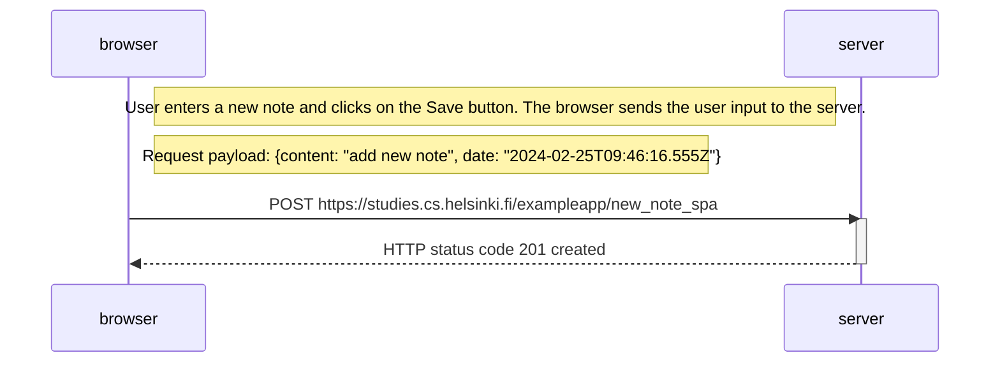

```mermaid
sequenceDiagram
    participant browser
    participant server

    Note right of browser: User enters a new note and clicks on the Save button. The browser sends the user input to the server.
    Note right of browser: Request payload: {content: "add new note", date: "2024-02-25T09:46:16.555Z"}

    browser->>server: POST https://studies.cs.helsinki.fi/exampleapp/new_note_spa
    activate server
    server-->>browser: HTTP status code 201 created
    deactivate server

```